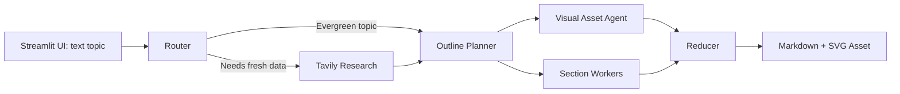

# Agentic LangGraph Blog Writer

A professional Streamlit and LangGraph application that turns one text topic into a polished Markdown blog post with a generated graphical visual. The project demonstrates agentic workflow design, structured LLM outputs, live research routing, automated visual asset creation, and a recruiter-friendly user experience.

## Highlights

- **Text-only input**: users only enter a blog topic.
- **Generated blog visual**: a visual asset agent designs an infographic-style SVG and embeds it in the final Markdown post.
- **Agentic workflow**: LangGraph coordinates routing, research, outline planning, visual generation, parallel section writing, and final assembly.
- **Research-aware writing**: volatile topics are routed through Tavily search and cited with source links.
- **Structured outputs**: Pydantic schemas keep router decisions, evidence, outlines, visual specs, and writing tasks consistent.
- **Professional Streamlit UI**: preview the article, inspect the generated visual, view raw Markdown, and download the final file.
- **Safe file output**: generated blogs and assets are saved to `outputs/` with Windows-safe filenames.

## Demo Workflow

1. Enter a blog topic, for example `State of Multimodal LLMs in 2026`.
2. Click **Generate**.
3. The graph plans the article, creates a visual SVG, writes each section, and saves the final Markdown.
4. Review the article, generated visual, raw Markdown, and downloaded output.

## Architecture



## Tech Stack

- Python 3.12
- Streamlit
- LangGraph
- LangChain
- OpenAI `gpt-4.1-mini` by default, configurable with `OPENAI_MODEL`
- Tavily Search
- Pydantic

## Project Structure

```text
.
|-- app.py                         # Main Streamlit and LangGraph application
|-- Blog_agent_research_tool.ipynb  # Notebook version of the agent workflow
|-- requirements.txt               # Python dependencies
|-- .env.example                   # Environment variable template
|-- .gitignore                     # Runtime and secret exclusions
|-- LICENSE
`-- outputs/                       # Generated Markdown and SVG assets, ignored by git
```

## Getting Started

### 1. Clone the repository

```bash
git clone https://github.com/your-username/agentic-langgraph-blog-writer.git
cd agentic-langgraph-blog-writer
```

### 2. Create a virtual environment

```bash
python -m venv .venv
.venv\Scripts\activate
```

On macOS or Linux:

```bash
python -m venv .venv
source .venv/bin/activate
```

### 3. Install dependencies

```bash
pip install -r requirements.txt
```

### 4. Configure environment variables

Copy `.env.example` to `.env` and add your keys:

```bash
OPENAI_API_KEY=your_openai_api_key_here
TAVILY_API_KEY=your_tavily_api_key_here
OPENAI_MODEL=gpt-4.1-mini
```

`TAVILY_API_KEY` is required for live web research. Evergreen topics can still run without search if the router does not request research.

### 5. Run the app

```bash
streamlit run app.py
```

Open the local Streamlit URL shown in your terminal.

## How The Generated Visual Works

After the outline is created, the visual asset agent receives the topic, audience, blog kind, outline tasks, and evidence summary. It produces a structured `VisualAssetSpec` with a title, subtitle, key points, callouts, caption, and alt text.

The app renders that specification into an SVG infographic and saves it in `outputs/assets/`. The final Markdown file includes the generated visual using a relative image link:

```markdown


*Generated caption for the article visual.*
```

This keeps the app fully text-driven while still producing a blog with a graphical element.

## Agent Flow

1. **Router** decides whether the topic needs live web research.
2. **Research Node** gathers and deduplicates Tavily evidence when needed.
3. **Orchestrator** creates a structured blog plan with 5 to 9 writing tasks.
4. **Visual Asset Agent** designs and renders an SVG infographic.
5. **Worker Nodes** write individual sections in parallel.
6. **Reducer** embeds the visual, merges sections, and saves the final Markdown file.

## Environment Variables

| Variable | Required | Purpose |
| --- | --- | --- |
| `OPENAI_API_KEY` | Yes | Runs the LLM, structured outputs, and writing agents |
| `TAVILY_API_KEY` | Optional | Enables live web research for current topics |
| `OPENAI_MODEL` | Optional | Overrides the default OpenAI model |

## Recruiter-Focused Talking Points

- Designed a graph-based multi-agent writing workflow with deterministic state passing.
- Used structured outputs to reduce brittle prompt parsing.
- Added an internal visual asset agent that generates and embeds SVG graphics from text-only input.
- Implemented source-aware writing for timely or news-like topics.
- Improved developer experience with `.env.example`, dependency cleanup, ignored runtime artifacts, and a polished README.

## Future Improvements

- Add automated tests for filename safety, graph state transitions, and visual rendering.
- Add a model selector for cost and quality tradeoffs.
- Export to PDF or DOCX in addition to Markdown.
- Add optional animated GIF rendering for process-heavy topics.
- Store generated posts and assets with metadata in a lightweight database.

## License

This project is licensed under the terms in [LICENSE](LICENSE).
